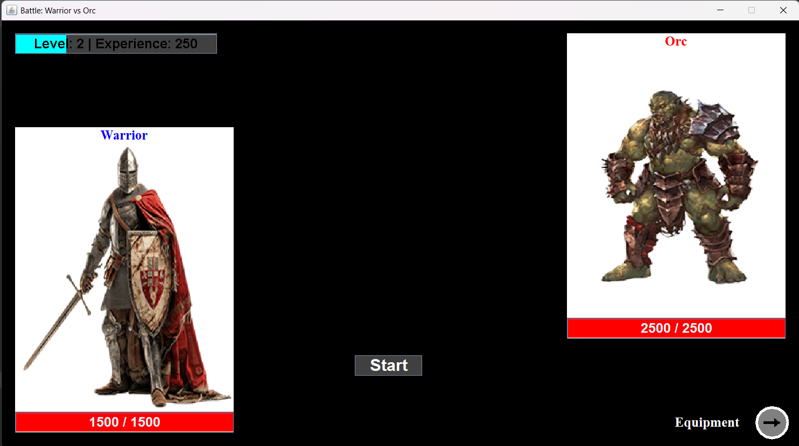

# IST-JAV25-assignment

## 1. Project Overview
This project is a standalone Java application implementing a core Turn-Based Role-Playing Game (RPG) combat and character management system.
The application allows users to create and manage player profiles, select diverse character classes, engage in simulated combat scenarios, manage equipment, and track progress through an experience system.

## 2. Key features
__1. Character & Combat System__\
The game features a rich set of character entities, each defined by core stats and distinct abilities.
  - __Different Character Classes__: Includes playable classes (Warrior, Archer, Wizard) and enemy types (Dragon, Goblin, Orc). All characters inherit from the CharacterModel base class, ensuring consistent behavior across all entities.
  - __Combat Logic__: The GameController manages the turn-based combat flow, determining actions, damage calculations, and win/loss conditions.

__2. Equipment and Items System__\
A complete system for handling inventory and character equipment, supporting both consumption and permanent enhancements.
  -	__Equippable Items__: Defined by the Equipable class, items like Sword, Crossbow, Armor, and Shield modify character stats. The system is managed via the EquipmentController.
  -	__Consumables__: Includes various Potion types (HealthPotion, PowerfulPotion, SpeedPotion) that can be used during gameplay.

__3. User Management & Persistence__\
The application includes a system to manage user accounts and application state across sessions.
  - __User Profiles__: Users are handled by the User class and managed via the Singleton UserManager.
  - __Session Management__: The UserManager handles login, user creation, experience updates, and data persistence by writing user data to a dedicated file (users.txt), ensuring user progress is saved.

__4. Graphical User Interface__\
The entire application runs on a dedicated, custom-built Graphical User Interface (GUI), providing an intuitive experience.
  - __Dedicated Windows__: The game flow is driven by dedicated windows, including the IntroductionWindow, CharacterSelection, GameWindow, and EquipmentWindow.
  - __Visual Feedback__: Components like HealthProgressBar and ExperienceProgressBar provide real-time visual feedback on character status.
  - __Interactive Components__: Uses custom components (RoundButton, ItemLabel) and listeners (DropListener, EquipmentEventListener) for interactive gameplay.

Example of the GameWindow view:


## 3. Project Structure
```
Game/
└── resources/
|   └── data/
|   |   └── users.txt
|   |
|   └── images/
|       └── *.png
|
└── src/
    └── Main.java
    |
    └── controller/
    |   └── eventListeners/
    |   |   └── CharacterEventListener.java
    |   |       DropListener.java
    |   |       EquipmentEventListener.java
    |   |
    |   └── gameFlow/
    |   |   └── CharacterSelectionController.java
    |   |       GameController.java
    |   |       IntroductionController.java
    |   |
    |   └── system/
    |       └── EquipmentController.java
    |           MessageController.java
    |
    └── model/
    |  └── core/
    |  |   └── CharacterType.java
    |  |       Difficulty.java
    |  |       ItemType.java
    |  |       Stats.java
    |  └── entity/
    |  |   └── base/
    |  |   |   └── CharacterModel.java
    |  |   |       Enemy.java
    |  |   |       PlayerCharacter.java
    |  |   |
    |  |   └── concrete/
    |  |       └── Archer.java
    |  |           Dragon.java
    |  |           Goblin.java
    |  |           Orc.java
    |  |           Warrior.java
    |  |           Wizard.java
    |  |
    |  └── items/
    |  |   └── base/
    |  |   |   └── Equipable.java
    |  |   |       Item.java
    |  |   |       Potion.java
    |  |   |
    |  |   └── concrete/
    |  |       └── Armor.java
    |  |           Crossbow.java
    |  |           HealthPotion.java
    |  |           PowerfulPotion.java
    |  |           Shield.java
    |  |           SpeedPotion.java
    |  |           Sword.java
    |  |
    |  └── users/
    |      └── Session.java
    |          User.java
    |          UserManager.java
    |
    └── utility/
    |   └── engine/
    |       └── DelayTimer.java
    |
    └── view/
        └── assets/
        |   └── Images.java
        |
        └── components/
        |   └── ExperienceProgressBar.java
        |       HealthProgressBar.java
        |       ItemLabel.java
        |       RoundButton.java
        |
        └── panels/
        |   └── CharacterSelection.java
        |       CharacterSelectionInterface.java
        |       EnemySelection.java
        |       EquipmentPanel.java
        |
        └── windows/
            └── EquipmentWindow.java
                GameWindow.java
                IntroductionWindow.java
                MyFrame.java
                UserWindow.java
```
## 4. How to run the code
To run the game on your local machine, you can use an IDE (recommended) or the terminal.

### Prerequisites
* **Java Development Kit (JDK):** Version 17 or higher is required.
* **Terminal/Command Prompt:** Accessible from your operating system.
---
## First option: using an IDE
### Step 1: Clone the repository
```bash
git clone https://github.com/angelolanzillotti/IST-JAV25-assignment-.git
```
### Step 2: Open the project
Import the IST-JAV25-assignment- folder into your IDE (e.g., IntelliJ IDEA, VS Code)
### Step 3: Configure resources folder
In IntelliJ, right-click the resources folder and select __Mark Directory as > Resources Root__. This is crucial for the application to locate __resources/data/users.txt__ and all graphical assets.
### Step 4: Compile and Run
Locate the __src/Main.java__, right-click the file and select __Run 'Main.main()'__.

---
## Second option: compile and run just using the terminal
### Step 1: Clone the repository
```bash
git clone https://github.com/angelolanzillotti/IST-JAV25-assignment-.git
```
### Step 2: Create an Output Directory
First, create a folder to store the compiled bytecode:
```bash
mkdir out 
```
This folder helps to separate the human-readable source code from the machine-executable bytecode. This helps to have a clean project, without mixing things. Moreover, by isolating compiled files, the Java Virtual Machine (JVM) can efficiently load the necessary classes from a single location without interfering with the original source files.
### Step 3: Compile the Source Code
```bash
cd IST-JAV25-assignment-
```
```bash
javac -d out -sourcepath src src/Main.java
```
### Step 4: Run the application
_The __-cp__ is mandatory to allow the program to correctly resolve the path to resources/data/users.txt and resources/images/*.png_\
__For macOS/Linux__
```bash
java -cp "out:resources" Main
```
__For Windows__
```bash
java -cp "out;resources" Main
```
## 5. Documentation
The complete technical documentation is generated via Javadoc.\
**[View Javadoc Documentation](https://angelolanzillotti.github.io/IST-JAV25-assignment-/docs/index.html)**

## 6. Possible improvements
### 1. Logout
  - __Logout functionality__: Implement a "Logout" button in the [UserWindow](https://angelolanzillotti.github.io/IST-JAV25-assignment-/src/view/windows/UserWindow.java) or [GameWindow](https://angelolanzillotti.github.io/IST-JAV25-assignment-/src/view/windows/GameWindow.java) to allow users to switch profiles.
### 2. Expanded Roster
  - __New Playable Classes__: Add new classes inheriting from [PlayerCharacter](https://angelolanzillotti.github.io/IST-JAV25-assignment-/src/model/entity/base/PlayerCharacter.java).
  - __New Enemy Types__: Add new types of characters inheriting from [Enemy](https://angelolanzillotti.github.io/IST-JAV25-assignment-/src/model/entity/base/Enemy.java).
### 3. Advanced Combat System
  - __Move Selection__: Replace the automatic attack with a __Skill Menu__ in [GameWindow](https://angelolanzillotti.github.io/IST-JAV25-assignment-/src/view/windows/GameWindow.java). Players can manually choose between different types of attack.
  - __Class-Specific Special Moves__: Implement moves typical for each character (e.g., _Wizard_: Fireball)
### 4. Level-Based Skills and Characters
  - __Ability Unlocking__: Discover new ability while the users goes up with the level.
  - __Characters Unlocking__: Accordingly with user's level, he can unlocked different characters and different levels of that type of character.
